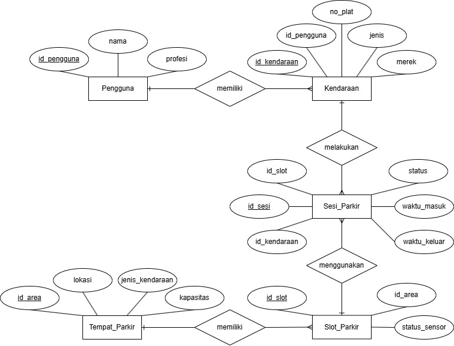

# SMPKO-PJBL
# Sistem Manajemen Parkir Kampus Otomatis (SMPKO) 🚗🏍️

Sebuah sistem *database* relasional untuk mengelola operasional parkir kampus secara otomatis, dirancang menggunakan **MariaDB/MySQL** dengan *Storage Engine* **InnoDB**.

## 📌 Deskripsi Proyek
Proyek ini dikembangkan sebagai bagian dari Project Based Learning (PBL) mata kuliah Sistem Basis Data. Sistem ini mampu melacak ketersediaan slot parkir secara *real-time*, mencatat riwayat *check-in*/*check-out*, dan menangani relasi data pengguna kampus (Dosen, Mahasiswa, Pegawai) dengan kendaraan mereka.

## ✨ Fitur Unggulan Database
* **Normalisasi 3NF:** Struktur tabel dirancang murni tanpa redudansi.
* **Automated Triggers:** * Sensor slot otomatis berubah menjadi 'Hidup' saat *check-in* dan 'Mati' saat *check-out*.
    * Validasi otomatis mencegah mobil parkir di slot motor (Error 1644).
    * Kapasitas gedung parkir (*update* otomatis) bertambah/berkurang saat ada slot baru yang dibangun.
* **Real-time Views:** Menggunakan SQL `VIEW` (`v_status_parkir`) untuk kalkulasi sisa slot tersedia tanpa membebani tabel master.

## 📊 Entity Relationship Diagram (ERD)

## 🚀 Cara Penggunaan
1. Import file `database/smpko.sql` ke dalam MariaDB/MySQL PHP Admin Website.
2. Semua tabel, relasi (Foreign Key), View, dan Trigger akan otomatis terpasang.
3. Jalankan query pengujian yang tersedia di dokumen laporan.

## 📄 Laporan Lengkap
Untuk melihat skenario pengujian, analisis DDL/DML, dan studi kasus lengkap, silakan baca [Laporan PBL SMPKO](Docs/LAPORAN PROJECT BASED LEARNING.pdf).
